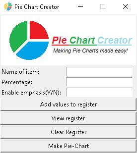

# Pie-Chart-Creator

A Python program which creates a pie chart using [MatPlotLib](https://github.com/matplotlib/matplotlib) and has a GUI created using [Tkinter](https://en.wikipedia.org/wiki/Tkinter). Feel free to copy and use my code anywhere, just don't forget to credit me!

I would like to thank [Ghanteyyy](http://github.com/ghanteyyy) for contributing to this project. This program wouldn't have been what it is today without his efforts.

**Important Note**

This program will not work unless `pie_chart_creator.py` and the `included_files` folder are in the same folder on your device.
