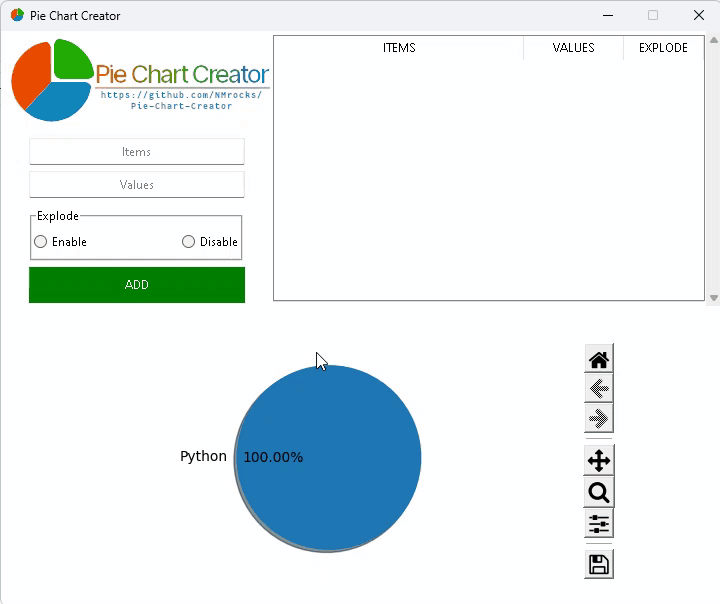

# Pie-Chart-Creator

## This repository is READ ONLY

I made this repository as a teenager in middle school back in July 2020. I have no interest in further maintaining this codebase. Please don't hesitate to fork if you want to carry this project forward.

A Python program which creates a pie chart using [MatPlotLib](https://github.com/matplotlib/matplotlib) and has a GUI created using [Tkinter](https://en.wikipedia.org/wiki/Tkinter)
